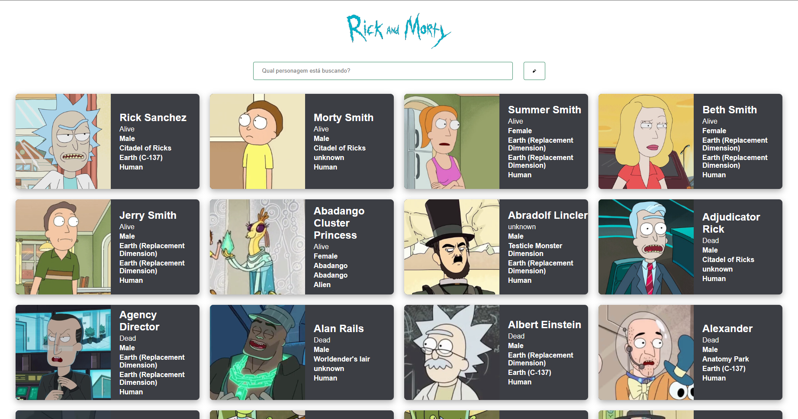
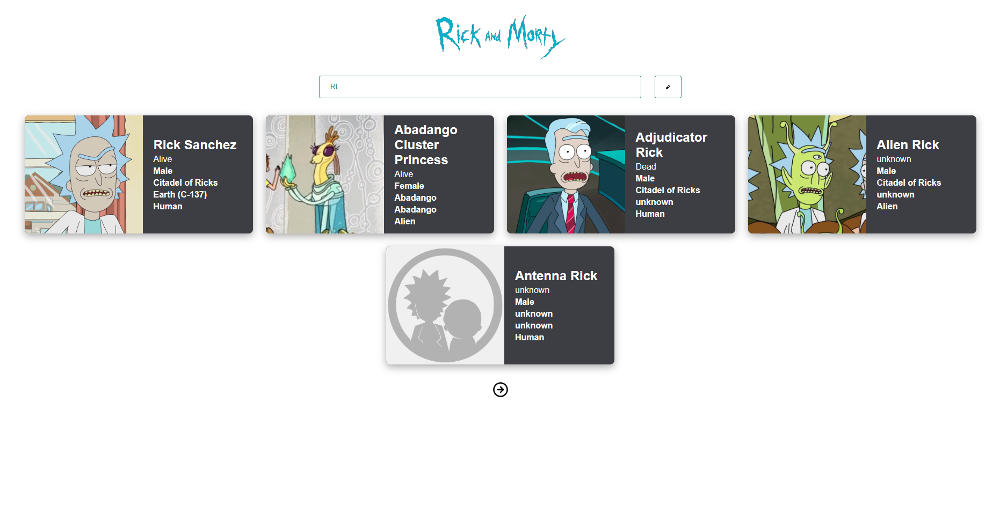

<h1 align="center">Rick And Morty Web</h1>

<!-- Getting Started -->
# Sobre a aplicação
Aplicação desenvolvida para aprimorar meus conhecimentos com React, Sass e consumo de API Rest.

### INICIANDO O PROJETO

Para instalar o projeto em sua maquina siga os passos abaixo.

### INSTALAÇÃO

1. Clone o repositório

   ```sh
   git clone https://github.com/NiloMarcos/Ricky-And-Morty-Web.git
   ```

2. Entre na pasta

   ```sh
   cd Ricky-And-Morty-Web
   ```

3. Instale as dependências

   ```sh
   yarn
   ```

   ou

   ```sh
   npm i

### Iniciar a aplicação
1. Abra seu terminal e rode o comando.
   ```sh
   yarn dev
   ```


### Apresentação da aplicação

<p align="center">

<div>
  
 
  
</div>